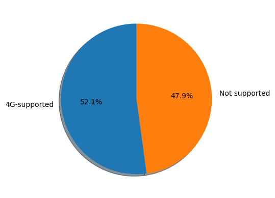

# Mobile-Phone-Price-Prediction
This project uses the phone prices data sets(train_set and test_set) from kaggle

# DATASET DESCRIPTION

*This dataset has 2000 samples with 21 features 
Here is a list of the features in this dataset:

**battery_power**:Total energy a battery can store in one time measured in mAh.\
**blue**:If the phone has bluetooth or not i.e *Yes = 1* or *No = 0*.\
**clock_speed**:Speed at which microprocessor executes instructions.\
**dual_sim**:If the phone has dual sim support or not, i.e *Yes = 1* or *No = 0*.\
**fc**:Front Camera mega pixels.\
**four_g**:Has 4G or not, i.e *Yes = 1* or *No = 0*.\
**int_memory**:Internal Memory in Gigabytes.\
**m_dep**:Mobile Depth in cm.\
**mobile_wt**:Weight of mobile phone.\
**n_cores**:Number of cores of processor.\
**pc**:Primary(Back) Camera mega pixels.\
**px_height**:Pixel Resolution Height.\
**px_width**:Pixel Resolution Width.\
**ram**:Random Access Memory in Megabytes.\
**sc_h:Screen** Height of mobile in cm.\
**sc_w**:Screen Width of mobile in cm.\
**talk_time**:Longest time that a single battery charge will last when you are on call.\
**three_g**:Has 3G or not, i.e *Yes = 1* or *No = 0*.\
**touch_screen**:Has touch screen or not, i.e *Yes = 1* or *No = 0*.\
**wifi**:Has wifi or not, i.e *Yes = 1* or *No = 0*.\
**price_range**: This classifies the prices of phones, i.e *0 = Low Budget*, *1 = Mid-Range*, *3 = Modest*, *4 = High Budget*.

# This project is intends to answer the following questions:
*What are the ranges of battery power, internal memory and rams of phones available in the market and it's influence on the price range.\
*influence of 3G and 4G enabled phones in the price of phones market.\
*What model best fits our price prediction task and it's accuracy level

# Benefit of project
*This type of prediction will help companies estimate price of mobile phones to give tough competion to other mobile phone manufacturers.\
*It will help consumers predict likely features a mobile phone has based on thier budget.\
*Also it will be usefull for Consumers to verify that they are paying best price for a mobile.

## MODELS EXPLORED
*Logistic Regression\
*K-NeighborsClassifier\
*DecisionTreeClassifier\
*Random Forest Classfier\
*Naive Bayes\
*Support Vector Classifier.

# Distribution of battery power, Internal Memory and phone ram.
.

.

.

# Single Sim vs Double sim-card

.

# 3G vs 4G phones

.

.

# Influence of some phone features on the price range
# Ram vs Price_range
.

# Internal memory vs price_range
.

# Battery power vs price_range

.

.

# Front camera vs Primary/Back camera

.

# Model Accuracy

.

